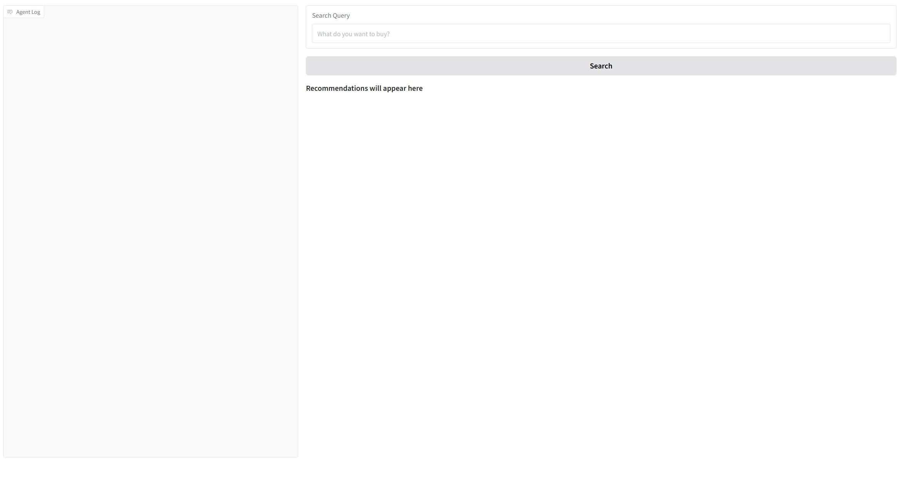
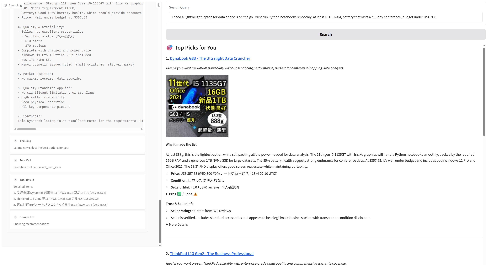
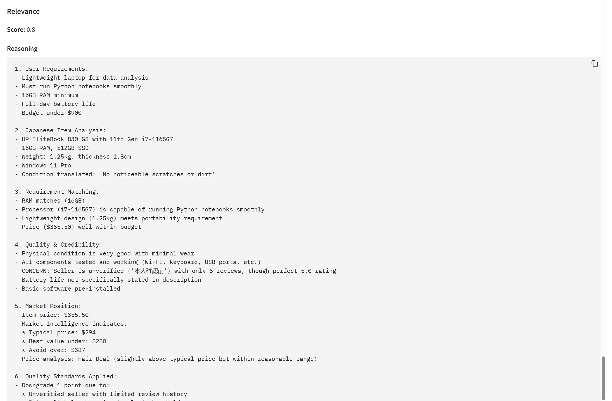
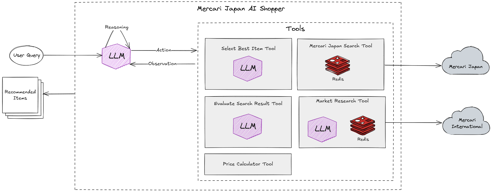

# Mercari Japan AI Shopper

**Author**: Surya Mahadi

## Table of Contents
- [Overview](#overview)
- [Setup Instructions](#setup-instructions)
- [Usage Instructions](#usage-instructions)
- [Pricing](#pricing)
- [Evaluation Results](#evaluation-results)
- [Design Choices](#design-choices)
  - [Architecture](#architecture)
  - [Memory](#memory)
  - [Tools](#tools)
  - [Prompt Engineering](#prompt-engineering)
  - [Caching](#caching)
  - [Large Language Model (LLM)](#large-language-model-llm)
  - [Stop Condition](#stop-condition)
  - [User Interface](#user-interface)
  - [Error Handling and Retries](#error-handling-and-retries)
  - [Logging](#logging)
- [Potential Improvements](#potential-improvements)

## Overview
This project is an AI-powered shopping assistant designed to navigate Mercari Japan, a popular Japanese e-commerce platform. It leverages a Large Language Model (LLM) configured as a ReAct (Reasoning and Acting) agent to provide users with intelligent, context-aware product recommendations. Given a natural language query (e.g., "a good phone for gaming under $500"), the agent can perform multi-step reasoning, use a suite of tools to search for products, analyze market prices, evaluate their relevance, and present the top 3 choices with detailed, user-centric justifications.

## Setup Instructions

### Prerequisites

- Docker
- Docker Compose

### Setup

1. Create a `.env` file, or you can copy the `.env.example` file and rename it to `.env`.
```bash
cp .env.example .env
```

2. Fill in the `.env` file with the correct values.
- `ANTHROPIC_API_KEY`: The API key for the Anthropic API.
- `MODEL_NAME`: The name of the model to use. Defaults to `claude-3-5-sonnet-latest`.
- `REDIS_HOST`: The host of the Redis server. Defaults to `redis`.
- `REDIS_PORT`: The port of the Redis server. Defaults to `6379`.

3. Build and run the Docker container:
```bash
docker-compose up
```

your application should be running on [http://localhost:7860](http://localhost:7860).


## Usage Instructions
1. Open your browser and navigate to [http://localhost:7860](http://localhost:7860). It should look like this:



2. Enter your query in the input field and click the "Search" button.

For example, type in the following query:
```
I need a lightweight laptop for data analysis on the go. Must run Python notebooks smoothly, at least 16 GB RAM, battery that lasts a full-day conference, budget under USD 900.
```
and press enter or click the "Search" button.

3. Wait the process to complete. It took me about 5 minutes to complete the process.

4. You can see the recommended items and the reasoning process.



5. You also can see the detailed report for each item in the `More Details` section.



## Pricing

Based on experimental usage data, here are the estimated costs per query:

### Cost Analysis

**Experiment 1:**
- Cost: $0.25 per complete query
- Tool calls: 7 tools used
- Average cost per tool call: ~$0.036

**Experiment 2:**
- Cost: $0.43 per complete query  
- Tool calls: 10 tools used
- Average cost per tool call: ~$0.043

### Cost Breakdown

The total cost per query depends on:
- **Number of tool calls**: More complex queries requiring multiple searches, market research, and evaluations will cost more
- **LLM API usage**: Claude 3.5 Sonnet API calls for reasoning and tool orchestration
- **Prompt caching**: Reduces costs for repeated system prompts
- **Context management**: Longer conversations may require context condensation

### Estimated Usage Costs

- **Simple queries**: ~$0.25 (7 tool calls)
- **Complex queries**: ~$0.43 (10 tool calls)
- **Average cost per tool call**: ~$0.04

**Note**: These costs are based on Claude 3.5 Sonnet pricing and may vary depending on:
- Query complexity
- Number of items searched and evaluated
- Market research depth
- Current Anthropic API pricing

## Evaluation Results

To assess the system's performance, I conducted an evaluation using [LangChain agent trajectory accuracy](https://github.com/langchain-ai/agentevals) methodology across 5 diverse test queries. The evaluation was performed using **OpenAI o3 mini** as the evaluator model, which assessed whether the agent follows a logical, efficient progression toward achieving the user's goal.

### Evaluation Methodology

The evaluation uses **trajectory accuracy** as the primary metric, which assesses:
- Logical progression of reasoning and actions
- Efficiency in achieving the stated goal
- Appropriate tool selection and usage
- Clear progression between steps

**How the Evaluation Works:**

The trajectory accuracy evaluation examines the complete sequence of the agent's internal reasoning and tool usage from start to finish. For each test case, **OpenAI o3 mini** acts as an expert evaluator that:

1. **Analyzes the user's goal** by examining the input query and the final output
2. **Traces the logical flow** of the agent's reasoning and actions throughout the entire trajectory
3. **Evaluates step-by-step progression** to ensure each action builds logically on the previous one
4. **Assesses efficiency** - the path should be reasonably direct without requiring perfect optimization
5. **Determines overall coherence** - whether the sequence makes sense as a whole toward achieving the goal

The evaluator gives a binary pass/fail score based on whether the trajectory demonstrates logical sense, clear progression, and relative efficiency in moving from the user's query to the final recommendation.

### Test Results

| Test # | Query | Trajectory Accuracy | Detailed Evaluation Comments |
|--------|-------|-------------------|------------------------------|
| 1 | "recommend me a dark jacket for winter" | ✅ **Pass** | The trajectory starts with a clear understanding of the user query and proceeds logically through a series of steps to gather relevant product information. The agent makes an initial search using a Japanese query for a dark winter jacket, then reviews market data on selected items, and evaluates their suitability based on conditions, pricing, and seller credibility. The process is systematic, showing progression from searching, gathering market research data, detailed evaluation of product listings, and finally selecting the best item based on the criteria. Each internal tool call is logically connected and contributes to achieving the recommendation goal. |
| 2 | "I need a lightweight laptop for data analysis on the go. Must run Python notebooks smoothly, at least 16 GB RAM, battery that lasts a full-day conference, budget under USD 900." | ✅ **Pass** | The trajectory clearly understands the user's goal—which is to find a lightweight laptop for data analysis with specifications such as at least 16GB RAM, full-day battery, and a budget under $900—and it follows a logical sequence: first converting the budget from USD to JPY to set a proper price range, then conducting a search on a Japanese marketplace, followed by market research and evaluation of search results against the requirements. The progression between the steps is clear and each tool call builds on the previous step, leading eventually to a selection of potentially best items. Therefore, the trajectory is logically sound, shows clear progression, and is relatively efficient in achieving its goal. |
| 3 | "I have a lower backpain, recommend me something to reduce its pain" | ✅ **Pass** | The trajectory demonstrates a clear progression toward addressing the user's query. It starts by understanding the query (to recommend a product for lower back pain), then performs appropriate searches with targeted queries, refines the results, and uses market research and evaluation tools to assess the items. Each step logically builds on the previous one, leading to a recommendation, which is aligned with the goal of providing a back pain reduction solution. |
| 4 | "I want a high end gaming PC, I want to be able play any game at maximum setting. my budget is unlimited" | ✅ **Pass** | The trajectory clearly demonstrates logical progression. It begins by understanding the user query for a high-end gaming PC with an unlimited budget and then performs a series of targeted tool calls to search for suitable items. The steps proceed in a logical order: initiating a search, analyzing market data, evaluating search results, and finally selecting the best item. Each step builds on the previous one, and the approach is efficient and aligned with the goal. |
| 5 | "I need something to get rid of bedbug in my room" | ✅ **Pass** | The trajectory exhibits logical progression from understanding the user's need (bedbug elimination) to sequentially executing tool calls that perform item searches, market research, evaluation, and finally selection of recommendations. Each step builds logically on the previous one and the process is efficient and systematic. |

### Overall Performance

- **Trajectory Accuracy**: **100%** (5/5 tests passed)
- **Key Strengths**:
  - Consistent logical progression across diverse query types
  - Appropriate tool selection for each step
  - Efficient path to recommendations
  - Clear understanding of user requirements
  - Systematic evaluation process

### Query Diversity Coverage

The evaluation covered various product categories and complexity levels:
- **Fashion**: Winter jacket (simple query)
- **Technology**: Laptop with specific technical requirements (complex query)
- **Health**: Back pain relief products (problem-solving query)
- **Gaming**: High-end PC (unlimited budget query)
- **Home**: Pest control solutions (specific problem query)

This comprehensive evaluation demonstrates the agent's ability to handle diverse user needs while maintaining consistent logical reasoning and efficient tool usage across different product categories and query complexities.

## Design Choices

### Architecture



In this project, I decided to use ReAct agent architecture proposed by [Yao et al., 2022](https://arxiv.org/abs/2210.03629). This architecture is a combination of reasoning and acting in language models.

Generating reasoning traces allow the model to induce, track, and update action plans, and even handle exceptions. The action step allows to interface with and gather information from external sources such as knowledge bases or environments.

The ReAct framework can allow LLMs to interact with external tools to retrieve additional information that leads to more reliable and factual responses.

Results show that ReAct can outperform several state-of-the-art baselines on language and decision-making tasks. ReAct also leads to improved human interpretability and trustworthiness of LLMs. Overall, the authors found that best approach uses ReAct combined with chain-of-thought (CoT) that allows use of both internal knowledge and external information obtained during reasoning.

For this shopping agent, the ReAct paradigm is particularly effective. The process of finding the right product is not a single task; it's a sequence of searching, filtering, analyzing, and comparing. ReAct allows the agent to break down this complex process into a series of thoughts and actions. It can formulate a search strategy, execute a search tool, observe the results, and then reason about the next best action—whether that's refining the search, researching a specific product's market value, or evaluating its relevance. This iterative process, combining the LLM's reasoning with factual information from external tools, makes the agent's recommendations more reliable and transparent.

### Memory

The agent maintains two primary forms of memory during a single user session: the conversational chat history and a structured `State` object. The chat history provides sequential context for the LLM, allowing it to follow the flow of reasoning and tool usage.

The `State` object, in parallel, acts as a structured "scratchpad" for the current job. It's created at the beginning of a run and passed between the agent and its tools. This allows for the structured accumulation and modification of data, like search results and candidate items, separate from the conversational flow.

The `State` object contains the following fields:

| Field | Type | Description |
| :--- | :--- | :--- |
| `user_query` | string | The original, unmodified query provided by the user. This is used as the "source of truth" for all evaluation steps. |
| `search_results` | list[Item] | A list of all items found by the `MercariJPSearchTool`. This list can grow as the agent performs multiple searches. |
| `recommended_candidates` | list[Item] | A subset of items from `search_results` that have been evaluated with a relevance score. This list acts as the pool of candidates for the final selection. |
| `recommended_items` | list[ItemRecommendation] | The final list of top 3 items selected by the `SelectBestItemTool`, complete with detailed reasoning. When this list contains 3 items, the agent's job is done. |

### Tools

The agent's capabilities are extended through a set of specialized tools. Each tool is a function that the agent can choose to call to gather information or perform a specific action. This separation of concerns allows the agent to interact with external services and data sources in a structured way.

#### Mercari Japan Search Tool

This is the agent's primary tool for discovery. It takes a search query (which the agent translates to Japanese) and optional price filters (in JPY) to search for products on the Mercari Japan website. It returns a list of candidate items that serve as the starting point for the agent's analysis. *See [Prompt Engineering](#prompt-engineering) for details on the Japanese translation strategy.*

| Parameter | Type | Description |
| :--- | :--- | :--- |
| `query` | string | The search term, preferably in Japanese. |
| `min_price` | integer | (Optional) The minimum price in JPY. |
| `max_price` | integer | (Optional) The maximum price in JPY. |
| `max_items` | integer | (Optional) The maximum number of items to return. Defaults to 10. |
| `sort_by` | string | (Optional) Field to sort by. Can be `num_likes`, `score`, `created_time`, or `price`. Defaults to `score`. |
| `order` | string | (Optional) Sort order. Can be `asc` or `desc`. Defaults to `desc`. |

To perform the search, I implemented scraping using [Playwright](https://playwright.dev/), since the website contain anti-bot detection, so by using requests and beautifulsoup, is not enough, we need to execute javascript code to get the data. The search process follow this steps:
1. Search the query in `https://jp.mercari.com/search?keyword={query}` with optional parameters like `min_price`, `max_price`, `sort_by`, `order`, `max_items`.
2. Wait for the page to load. If not found page that contains text `出品された商品がありません` found, the search is failed and stopped.
3. Get all items until we reach the `max_items` limit. In this step we only get basic information like `item_id`, `item_url`, `item_name`, `item_price`, `item_currency`, and `item_image_url`.
4. To get more detailed information, we need to visit the item page. In this step, I scraped the item details in parallel using `asyncio.gather` and `asyncio.Semaphore(5)` to speed up and maintain memory usage.
5. At this point, each item detail will be cached in Redis, so if the same item is searched again, the result will be returned from the cache.
6. All the item details are then gathered and combined to the inital item list. Below is the data structure of the item:

**Item Structure:**

| Field | Type | Description |
| :--- | :--- | :--- |
| `id` | string | The ID of the item. |
| `name` | string | The name of the item. |
| `price` | float | The price of the item. |
| `currency` | string | The currency of the item. |
| `brand` | string (optional) | The brand of the item. |
| `condition_grade` | string (optional) | The condition grade of the item. |
| `availability` | string (optional) | The availability of the item. |
| `image_url` | string | The URL of the item's image. |
| `item_url` | string | The URL of the item. |
| `item_detail` | ItemDetail (optional) | The detail of the item. |
| `relevance_score` | ItemRelevanceScore (optional) | The relevance score of the item. |
| `market_research_result` | MarketIntelligenceResult (optional) | The market research result of the item. |

**ItemDetail Structure:**

| Field | Type | Description |
| :--- | :--- | :--- |
| `converted_price` | string (optional) | The converted price of the item. |
| `description` | string | The description of the item. |
| `condition_type` | string | The condition type of the item. |
| `posted_date` | string (optional) | The date the item was posted. |
| `delivery_from` | string | The country the item is being delivered from. |
| `shipping_fee` | string (optional) | The shipping fee of the item. |
| `seller_name` | string | The name of the seller. |
| `seller_username` | string (optional) | The username of the seller. |
| `seller_review` | integer | The number of reviews the seller has. |
| `seller_review_stars` | float | The average rating of the seller. |
| `categories` | list[string] | The categories the item belongs to. |
| `seller_verification_status` | string (optional) | The credibility of the seller. |
| `num_likes` | integer (optional) | The number of likes the item has. |

#### Price Calculator Tool

A simple but essential utility tool. When a user provides a budget in a currency like USD, the agent uses this tool to convert it to Japanese Yen (JPY). This ensures that the price filters used in the `MercariJPSearchTool` are accurate for the target marketplace.

| Parameter | Type | Description |
| :--- | :--- | :--- |
| `source_currency` | string | The currency to convert from (Only "USD" and "JPY" are supported). |
| `target_currency` | string | The currency to convert to (Only "USD" and "JPY" are supported). |
| `source_price` | float | The amount of money in the source currency. |

The conversion implementation is actually hardcoded for simplicity, here is the conversion rate:
```
JPY to USD: 0.0068
USD to JPY: 147.42
```

#### Market Research Tool

This tool provides crucial financial context. Given a specific item, it uses an LLM to analyze the product's details and search for comparable listings to determine its approximate market value. It returns a summary of typical market prices, helping the agent to assess whether a listing is a bargain, fairly priced, or overpriced.

| Parameter | Type | Description |
| :--- | :--- | :--- |
| `item_ids` | list[string] | A list of item IDs (from a previous search) to research. |

This tool follow this steps:
1. Use LLM to generate a specific query in English based on the item name, description and categories.
2. Use that query to search in [Mercari International](https://www.mercari.com).
3. Retrieve all item prices from the search results.
4. Next we will analyze the statistics of the prices like `min`, `max`, `average`, `median`, `budget_range_max`, `mid_range_min`, `mid_range_max`, `premium_range_min`, `excellent_deal_max`, `good_deal_max`, `overpriced_min`.
5. Then we will calculate the price volatility using `Interquartile Range (IQR)` to assess price volatility and generate `Quartile Coefficient of Dispersion (QCD)` score and follow this rules:
    - If QCD <= 0.10, the price is `stable`.
    - If QCD <= 0.20, the price is `moderate`.
    - If QCD > 0.20, the price is `volatile`.
6. Then we will generate a natural language summary of the market research result.

Here is the example:
```
Market Intelligence Report:
Summary: Market intelligence for HP EliteBook 830 G8 11th Gen Intel Core i7-1165G7 16GB 512GB SSD 13.3 inch Windows 11 Pro: 
Analyzed 13 items. 
Typical price: USD294 (¥43,346) (range: USD89 (¥13,120)-USD549 (¥80,934)). 
Price volatility: volatile. 
Recommendation: Look for items under USD280 (¥41,219) for best value. Avoid items over USD387 (¥57,052).
Price Strategy: High price volatility. Wait for significant discounts.
Value Strategy: Best value: items under USD280 (¥41,219). Avoid: items over USD387 (¥57,052). Typical range: USD250 (¥36,855) - USD350 (¥51,597).
Expected Price: Expect to pay around USD294 (¥43,346) for typical quality
Price Volatility: volatile
```

The market research result is cached in Redis, so if the same item is researched again, the result will be returned from the cache.

#### Evaluate Search Result Tool

After finding items and analyzing their market price, this tool evaluates how well each item matches the user's original query. It uses an evaluation technique called [G-Eval](https://arxiv.org/abs/2303.16634) to compare the item's specifications and description against the user's needs, producing a `relevance_score` from 1 to 5. This score is critical for filtering out irrelevant items and identifying the most promising candidates. Basically G-Eval utilizing chain-of-thought (CoT) and form-filling paradigms to evaluate the relevance of the item to the user's query. In their paper, they use the probability-weighted summation of the output scores as the final score, but in this project, I just use the value generated from the LLM as the final score. To make the score easy to understand, I convert it to 0-1 range.

I run the evaluation in parallel using `asyncio.gather` to speed up the process. All item that has been evaluated will be stored in `recommendation_candidates` key in the [State](#memory) object.

| Parameter | Type | Description |
| :--- | :--- | :--- |
| `item_ids` | list[string] | A list of item IDs to evaluate for relevance. |

The tool uses a sophisticated evaluation prompt that implements multi-criteria assessment including quality analysis, seller credibility, fraud detection, and market position evaluation. *See [Prompt Engineering](#prompt-engineering) for detailed explanation of the evaluation framework.*


#### Select Best Item Tool

This is the final tool. Once the agent has gathered and evaluated a set of strong candidate items (with a relevance score >= 0.8), it calls this tool. It uses a specialized prompt to instruct an LLM to perform a final, holistic comparison of the candidates. It selects the top 3 items and generates the detailed, user-friendly reasoning for each, including a title, persona fit, pros, and cons.

This tool takes no arguments from the agent; it automatically operates on all candidate items in `recommendation_candidates` key in the [State](#memory) object that have a relevance score of 0.8 or higher. *See [Prompt Engineering](#prompt-engineering) for details on the selection prompt logic.*

### Prompt Engineering

The agent's behavior is controlled through carefully crafted prompts that guide the LLM's reasoning and decision-making processes. The prompt engineering approach ensures systematic, intelligent, and user-focused recommendations.

#### System Prompt (Agent Behavior)

The main system prompt (`SYSTEM_PROMPT`) serves as the "brain" of the ReAct agent, providing detailed instructions on how to approach different types of user queries.

**Key Components of the System Prompt:**

| Component | Description |
| :--- | :--- |
| **Core Principles** | Defines 5 key behaviors: Be Thorough, Strategic, Analytical, Reflective, and Adaptive |
| **Language Instructions** | Specifies to use Japanese keywords for Mercari searches but respond in English |
| **Tool Descriptions** | Explains all 5 available tools and their specific use cases |
| **Price & Budget Strategy** | Instructions for handling USD budgets and converting to JPY for searches |
| **Search Strategy** | Different approaches for specific vs. general/vague requests |
| **Brand Diversity Strategy** | Ensures exploration of multiple manufacturers and brands |
| **Japanese Keyword Strategy** | Guidelines for using katakana, hiragana, and Japanese product terms |
| **Decision Framework** | 6-step process: Understand → Search → Market Research → Evaluate → Optimize → Select |
| **Stopping Criteria** | Clear conditions for when to call `select_best_item` tool |
| **Evaluation Requirements** | Standards for item assessment before final selection |

**Search Strategy Examples:**
- **Specific Request**: "iPhone 14 Pro Max 128GB under $1000" → Convert USD to JPY → Use precise Japanese terms
- **General Request**: "good smartphone" → Start broad with "スマートフォン" → Analyze results → Narrow down

**Supporting Prompts:**
- `USER_PROMPT`: Simple template for injecting user queries
- `RECOMMEND_MORE_ITEMS_PROMPT`: Used when the agent needs to find additional items
- `CONDENSED_PROMPT`: Applied when context window is full, preserving essential information

#### Evaluation Prompt (Quality Assessment)

The evaluation prompt implements a multi-criteria assessment framework using the G-Eval technique to score item relevance and quality.

**Language Handling:**
- **Input**: Processes Japanese item data (titles, descriptions, conditions) and English/Japanese user queries
- **Output**: Provides reasoning and evaluation in English with translated key details
- **Cross-language**: Bridges Japanese marketplace data with English user needs

**Relevance Scoring (1-5 Scale):**
- **5 (Perfect Match)**: Meets all requirements with good quality/condition
- **4 (Good Match)**: Meets most requirements with minor limitations
- **3 (Moderate Match)**: Meets basic requirements but has significant issues
- **2 (Poor Match)**: Superficial match with major quality issues
- **1 (Irrelevant)**: Does not meet key requirements or has fundamental issues

**Quality Assessment Framework:**
- **Condition Analysis**: Evaluates item condition, completeness, and functionality
- **Seller Credibility**: Analyzes verification status, ratings, and review count
- **Fraud Detection**: Identifies misleading titles (e.g., "thumbnail", "box only", "junk")
- **Market Position**: Integrates market intelligence data for price evaluation

**8-Step Evaluation Process:**
1. **Identify User Requirements**: Extract key needs from user query
2. **Parse Japanese Item Data**: Understand titles, descriptions, and conditions
3. **Compare Requirements**: Match item attributes against user needs
4. **Assess Quality & Credibility**: Evaluate condition and seller trustworthiness
5. **Evaluate Market Position**: Compare price against market benchmarks
6. **Apply Quality Standards**: Downgrade for limitations, upgrade for excellent deals
7. **Synthesize Findings**: Combine all factors with English translations
8. **Assign Score**: Final 1-5 relevance score

**Market Intelligence Integration:**
- **Price Classification**: Excellent Deal → Good Deal → Fair Deal → Overpriced
- **Automatic Adjustments**: Upgrades excellent deals (+1 point), downgrades overpriced items (-1 to -2 points)
- **USD Conversion**: Handles JPY to USD price comparison with market data

**Example Outputs:**
- **Misleading Title Detection**: "Nintendo Switch thumbnail" → Score 1 (fraud risk)
- **Market-Informed Evaluation**: iPhone X at $450 vs. $525 typical price → Score 5 (excellent deal)

#### Selection Prompt (Final Recommendations)

The selection prompt transforms the agent into a "world-class AI personal shopper" that creates deeply personalized, evidence-based recommendations with transparent trade-offs.

**Core Principles for Reasoning:**
1. **Task-to-Spec Match**: Directly connects every feature to user's stated needs ("8GB RAM prevents app reloads while you multitask")
2. **Clear Trade-offs**: Upfront about pros and cons to build trust and help decision-making
3. **Evidence, Not Hype**: Uses concrete numbers and verifiable facts ("5000 mAh battery lasts ≈8 hours of screen-on time")
4. **Trust & Ownership**: Highlights seller reputation, reviews, warranty, and return policies

**Structured JSON Output Format:**
Each recommendation includes:
- **`item_id`**: Unique identifier
- **`title`**: Memorable title with nickname reflecting best use case (e.g., "The Value Powerhouse")
- **`persona_fit`**: Single-sentence summary starting with "Ideal if you want..."
- **`reasoning_summary`**: Detailed paragraph connecting features to user query with concrete evidence
- **`pros`**: Significant objective strengths
- **`cons`**: Significant objective weaknesses or trade-offs
- **`trust_signals`**: Seller rating summary and trust-related information

**Advanced Reasoning Guidelines:**
- **Real-world Performance**: Connects specs to actual user performance in specific use cases
- **Relative Positioning**: Positions each recommendation relative to others (best for gaming, best value, best overall balance)
- **Future-proofing**: Considers software support and performance longevity
- **Hidden Costs**: Mentions additional purchases needed or hidden expenses
- **Evidence-based**: Uses `relevance_score_reasoning` and `market_research` data for justification

**Selection Logic:**
- **Candidate Pool**: Automatically uses all items with relevance scores ≥ 0.8
- **Comparative Analysis**: Performs holistic comparison considering all factors
- **User-Centric Focus**: Generates explanations that help users make confident, quick decisions
- **Transparent Decision-making**: No product is perfect - highlights weaknesses to build trust

This comprehensive prompt engineering approach ensures that the agent follows a systematic methodology: understanding user needs, strategic searching with Japanese keywords, thorough market analysis, and intelligent evaluation before making final recommendations.

### Caching

To improve performance and reduce redundant computations, caching is implemented for the following tools:
- `MercariJPSearchTool`
- `MarketResearchTool`

The cache is powered by Redis and managed using the [aiocache](https://github.com/aio-libs/aiocache) library.

### Large Language Model (LLM)

This project uses the `claude-3-5-sonnet-latest` model from [Anthropic](https://www.anthropic.com/). Several strategies are employed to optimize its use. By default all LLM calls use 0 temperature to maintain consistency, especially on evaluation tools.

#### Prompt Caching
To reduce costs and improve latency on repeated, identical prompts, this project utilizes Anthropic's [prompt caching](https://docs.anthropic.com/en/docs/build-with-claude/prompt-caching) feature.

#### Context Size Management
To manage the LLM's context window, a hybrid approach is used:
1. The agent maintains a full chat history until the context size approaches its limit (I set it to `70,000` tokens to reduce cost).
2. If the limit is reached, the history is condensed. The last `3` messages are preserved, and a summary of the `recommendation_candidates` is injected into a new user prompt to maintain the most critical context for the next step.

#### Structured Output
At the time of implementation, Anthropic's Claude API lacked native structured output support, requiring a custom solution for parsing JSON responses. The project employs the [json-repair](https://github.com/mangiucugna/json_repair/) library to handle malformed JSON output from the LLM. This library automatically corrects common formatting issues in the model's raw text responses, ensuring consistent and reliable structured data extraction.

While an alternative approach would be to leverage tool call arguments for structured output, the custom JSON parser was chosen for its simplicity and direct integration with the existing codebase.

### Stop Condition

The agent's primary goal is to provide three high-quality recommendations. Therefore, the main stop condition is met when the `recommended_items` list in the [State](#memory) object contains three items. The agent will also stop if it reaches the maximum number of iterations (15) to prevent infinite loops.

### User Interface

The user interface is built with [Gradio](https://github.com/gradio-app/gradio). Gradio was chosen for its simplicity and its ability to quickly create interactive web UIs for machine learning models. Its native support for rendering Markdown and images makes it well-suited for displaying the agent's detailed, multi-faceted recommendations.

### Error Handling and Retries

To handle transient network issues and API errors from Anthropic (such as `529 overloaded_error` or `429 rate_limit_error`), the agent employs a retry mechanism. This is implemented using the `aioretry` library, which automatically re-attempts failed API calls with an exponential backoff strategy (up to 5 retries). For other unexpected errors during tool execution, the system logs the issue and is designed to continue processing where possible, ensuring greater resilience.

### Logging

The project uses [Loguru](https://github.com/Delgan/loguru) for logging. It provides clear, color-coded logs of the agent's thoughts, actions, and tool calls, which is invaluable for debugging and tracing the agent's reasoning process.

## Potential Improvements

- **Enhanced Search Strategy:** Implement more sophisticated search techniques, such as browsing by category or using filters for brand, condition, and seller, to better mimic human browsing patterns and yield more targeted results.
- **Interactive User Feedback:** Allow the agent to ask clarifying questions or for the user to provide feedback on initial results (e.g., "Show me more like this," "I don't like this brand"). This would create a more dynamic and conversational experience.
- **Visual Analysis:** Integrate a multi-modal model to analyze product images. This could be used to automatically detect cosmetic defects, verify included accessories, or identify details not mentioned in the text description.
- **Long-Term Monitoring:** Implement a feature where the agent can save a user's search and monitor Mercari over time, notifying the user when a new listing that matches their criteria and is a good value appears.
- **Improve Market Research:** Improve the market research by searching the similar item review to avoid recommending poor item quality.
- **Async tool calls:** Tools like market research can be run in background to avoid blocking.
- **Use Reflexion:**: We can use [Reflexion](https://arxiv.org/pdf/2303.11366) to give feedback for each action to the LLM to improve the agent's performance.